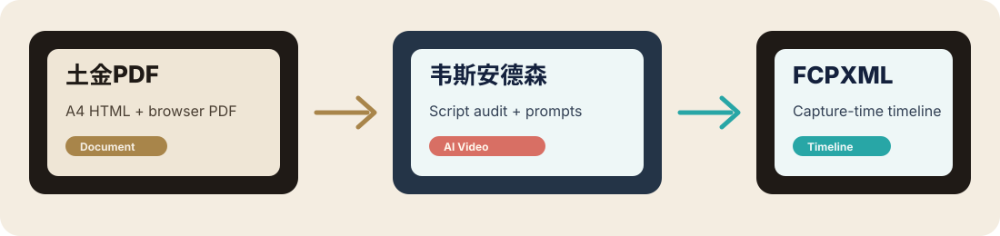

# JudeYang Skills

<p align="center">
  
</p>

<p align="center">
  <a href="#中文">中文</a> · <a href="#english">English</a>
</p>

<p align="center">
  
</p>

<p align="center">
  
  
  
  
  
</p>

---

## 中文

JudeYang 自用并开源的 Agent Skills 合集：**土金PDF、韦斯安德森视频工作流、镜头设计师、FCPXML 时间线工具**。

这些 skill 来自真实工作流，不是演示项目。每个目录都是一个可独立安装的 skill，包含自己的 `SKILL.md`、README、脚本、参考资料、`test-prompts.json`、`examples/` 和可运行校验脚本，方便用 Darwin 或人工回归检查持续迭代。



### Skill 目录

| Skill | 中文名 | 适合做什么 | 入口 | 校验 |
|---|---|---|---|---|
| [`tujinpdf`](tujinpdf/) | 土金PDF | 把现有文档排版成土金色系 A4 杂志风 PDF。 | [`SKILL.md`](tujinpdf/SKILL.md) | `node tujinpdf/scripts/validate-output.mjs output.html output.pdf preview.png` |
| [`wes-anderson`](wes-anderson/) | 韦斯安德森 | AI 短剧/短视频脚本审核、客户确认、设定资产、逐镜 Prompt 和最终归档。 | [`SKILL.md`](wes-anderson/SKILL.md) | `python wes-anderson/scripts/validate_workbook_structure.py workbook.xlsx --type client` |
| [`shot-designer`](shot-designer/) | 镜头设计师 | Seedance/LibTV 视频 Prompt、首尾帧/关键帧规划、参考素材绑定、逐秒镜头控制和 Prompt 校验。 | [`SKILL.md`](shot-designer/SKILL.md) | `python shot-designer/scripts/validate_prompt_detail.py --input workbook.xlsx` |
| [`fcpx-timeline`](fcpx-timeline/) | FCPX Timeline | 把本地视频、照片、Live Photo 按拍摄时间生成 Final Cut Pro 可导入的 FCPXML 时间线。 | [`SKILL.md`](fcpx-timeline/SKILL.md) | `python3 fcpx-timeline/scripts/validate-fcpxml.py timeline.fcpxml --fps 30` |

### 安装方式

在支持 Agent Skills 的运行环境中安装指定子目录：

```text
帮我安装这个 skill：https://github.com/judeyang/judeyang-skills/tree/main/tujinpdf
```

也可以手动 clone 后复制到本地 skills 目录：

```bash
git clone https://github.com/judeyang/judeyang-skills.git
cp -R judeyang-skills/tujinpdf ~/.codex/skills/
cp -R judeyang-skills/wes-anderson ~/.codex/skills/
cp -R judeyang-skills/shot-designer ~/.codex/skills/
cp -R judeyang-skills/fcpx-timeline ~/.codex/skills/
```

### 三个 skill

**土金PDF**

把 Markdown、TXT、HTML、DOCX/PDF/XLSX 提取内容、项目总结、客户确认材料重新排版成土金色系 A4 PDF。默认只改版式，不静默改写原文。

**韦斯安德森**

把 AI 短视频脚本变成完整生产包：脚本审核、客户确认总表、资产制作表、角色/场景/道具设定、逐镜 Prompt 表、最终确认 PDF。

**镜头设计师**

把已确认脚本和设定资产转成可执行视频 Prompt：三段式结构、参考图绑定、禁用 BGM、逐秒景别/机位/构图/运镜、首尾帧/关键帧策略和校验脚本。

**FCPX Timeline**

扫描本地媒体文件夹，按拍摄时间排序视频、照片、Live Photo，生成 Final Cut Pro 可导入的 FCPXML 时间线。

### 质量控制

- 每个 skill 都有 `test-prompts.json`，用于 Darwin 或人工回归评估。
- 每个 skill 都有 `examples/`，用于说明最小输入和期望输出。
- 每个 skill 都有 validator，交付前可运行检查结构、格式或输出合同。
- README 和 `SKILL.md` 保持同步，避免 GitHub 首页和实际使用说明脱节。

---

## English

JudeYang's open-source Agent Skills collection: **TuJin PDF, Wes Anderson video workflow, Shot Designer, and FCPXML timeline tools**.

These skills come from real production workflows, not demos. Each subdirectory is independently installable and includes its own `SKILL.md`, README, scripts, references, `test-prompts.json`, `examples/`, and runnable validators for Darwin or manual regression checks.


### Catalog

| Skill | Name | Best For | Entry | Validator |
|---|---|---|---|---|
| [`tujinpdf`](tujinpdf/) | TuJin PDF | Turning existing documents into earthy-gold A4 magazine-style PDFs. | [`SKILL.md`](tujinpdf/SKILL.md) | `node tujinpdf/scripts/validate-output.mjs output.html output.pdf preview.png` |
| [`wes-anderson`](wes-anderson/) | Wes Anderson | AI short-video script audit, client confirmation, asset production, per-shot prompts, and final archives. | [`SKILL.md`](wes-anderson/SKILL.md) | `python wes-anderson/scripts/validate_workbook_structure.py workbook.xlsx --type client` |
| [`shot-designer`](shot-designer/) | Shot Designer | Seedance/LibTV video prompts, first/end/keyframe planning, reference binding, time-coded camera control, and prompt validation. | [`SKILL.md`](shot-designer/SKILL.md) | `python shot-designer/scripts/validate_prompt_detail.py --input workbook.xlsx` |
| [`fcpx-timeline`](fcpx-timeline/) | FCPX Timeline | Generating capture-time ordered Final Cut Pro FCPXML timelines from local videos, photos, and Live Photos. | [`SKILL.md`](fcpx-timeline/SKILL.md) | `python3 fcpx-timeline/scripts/validate-fcpxml.py timeline.fcpxml --fps 30` |

### Installation

Ask a runtime that supports Agent Skills to install a specific subdirectory:

```text
Install this skill: https://github.com/judeyang/judeyang-skills/tree/main/tujinpdf
```

Or clone manually and copy the skill folders:

```bash
git clone https://github.com/judeyang/judeyang-skills.git
cp -R judeyang-skills/tujinpdf ~/.codex/skills/
cp -R judeyang-skills/wes-anderson ~/.codex/skills/
cp -R judeyang-skills/shot-designer ~/.codex/skills/
cp -R judeyang-skills/fcpx-timeline ~/.codex/skills/
```

### Skills

**TuJin PDF**

Restyles Markdown, TXT, HTML, extracted DOCX/PDF/XLSX content, project summaries, and client confirmation materials into earthy-gold A4 PDFs. By default it changes layout only and does not silently rewrite source content.

**Wes Anderson**

Turns an AI short-video script into a complete production package: script audit, client confirmation workbook, asset production sheet, character/scene/prop references, per-shot prompt tables, and final confirmation PDF.

**Shot Designer**

Turns approved scripts and visual assets into executable video prompts: three-part prompt structure, reference binding, BGM suppression, time-coded shot-size/camera/composition/movement control, first/end/keyframe strategy, and validation scripts.

**FCPX Timeline**

Scans a local media folder, sorts videos, photos, and Live Photos by capture time, and generates an FCPXML timeline that Final Cut Pro can import.

### Quality Control

- Every skill includes `test-prompts.json` for Darwin or manual regression scoring.
- Every skill includes `examples/` to document minimal inputs and expected outputs.
- Every skill includes a validator for checking structure, format, or output contracts before delivery.
- README files and `SKILL.md` stay synchronized so the GitHub homepage matches the actual workflow.

---

## License

MIT License. See [LICENSE](LICENSE).
