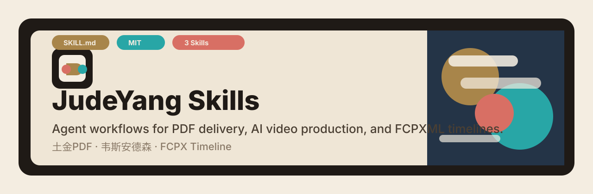

# JudeYang Skills

<p align="center">
  
</p>

<p align="center">
  <strong>Production-grade Agent Skills for document delivery, AI video workflows, prompt design, and FCPXML timelines.</strong>
</p>

<p align="center">
  <a href="#中文">中文</a> · <a href="#english">English</a>
</p>

<p align="center">
  
  
  
</p>

---

## 中文

JudeYang 自用并开源的 Agent Skills 合集。每个目录都是一个可独立安装的 skill，来自真实交付流程，不是演示样例。

### Skill 目录

| Skill | 用途 | 入口 |
|---|---|---|
| [`tujinpdf`](tujinpdf/) | 把现有文档排版成土金色系 A4 杂志风 PDF。 | [`SKILL.md`](tujinpdf/SKILL.md) |
| [`wes-anderson`](wes-anderson/) | AI 短剧/短视频脚本审核、客户确认、资产确认、项目归档。 | [`SKILL.md`](wes-anderson/SKILL.md) |
| [`shot-designer`](shot-designer/) | 视频 Prompt、首尾帧/关键帧规划、参考素材绑定、逐秒镜头控制。 | [`SKILL.md`](shot-designer/SKILL.md) |
| [`fcpx-timeline`](fcpx-timeline/) | 把本地视频、照片、Live Photo 按拍摄时间生成 FCPXML 时间线。 | [`SKILL.md`](fcpx-timeline/SKILL.md) |
| [`jude-project-operator`](jude-project-operator/) | 项目进入、开发修改、验证、Git 和文档闭环。 | [`SKILL.md`](jude-project-operator/SKILL.md) |
| [`jude-adversarial-review-loop`](jude-adversarial-review-loop/) | 独立审查、只读复核、盲测评分和修复闭环。 | [`SKILL.md`](jude-adversarial-review-loop/SKILL.md) |
| [`jude-workflow-to-skill-factory`](jude-workflow-to-skill-factory/) | 把重复提示、评分表和流程沉淀成可验证 Skill。 | [`SKILL.md`](jude-workflow-to-skill-factory/SKILL.md) |

### 推荐安装

```bash
git clone https://github.com/judeyang/judeyang-skills.git
cp -R judeyang-skills/tujinpdf ~/.codex/skills/
cp -R judeyang-skills/wes-anderson ~/.codex/skills/
cp -R judeyang-skills/shot-designer ~/.codex/skills/
cp -R judeyang-skills/fcpx-timeline ~/.codex/skills/
cp -R judeyang-skills/jude-project-operator ~/.codex/skills/
cp -R judeyang-skills/jude-adversarial-review-loop ~/.codex/skills/
cp -R judeyang-skills/jude-workflow-to-skill-factory ~/.codex/skills/
```

### 组合关系

`wes-anderson` 是视频项目总流程；到 Prompt 生产阶段会调用 `shot-designer`。  
`tujinpdf` 可用于把最终确认材料和项目归档做成用户版 PDF。  
`fcpx-timeline` 是独立工具，用于把本地媒体整理成 Final Cut Pro 时间线。
`jude-project-operator` 是所有项目开发和知识管理任务的进入与验收层。  
`jude-adversarial-review-loop` 负责独立审查、复审和盲测。  
`jude-workflow-to-skill-factory` 负责把高频重复流程沉淀成新 Skill。

### 校验命令

```bash
python shot-designer/scripts/validate_prompt_detail.py --input workbook.xlsx
python wes-anderson/scripts/validate_workbook_structure.py workbook.xlsx --type client
python3 fcpx-timeline/scripts/validate-fcpxml.py timeline.fcpxml --fps 30
node tujinpdf/scripts/validate-output.mjs output.html output.pdf preview.png
```

---

## English

JudeYang's open-source Agent Skills collection. Each subdirectory is independently installable and comes from real delivery workflows.

### Catalog

| Skill | Best For | Entry |
|---|---|---|
| [`tujinpdf`](tujinpdf/) | Turning existing documents into earthy-gold A4 magazine-style PDFs. | [`SKILL.md`](tujinpdf/SKILL.md) |
| [`wes-anderson`](wes-anderson/) | AI short-video script audit, client confirmation, asset confirmation, and project archives. | [`SKILL.md`](wes-anderson/SKILL.md) |
| [`shot-designer`](shot-designer/) | Video prompts, first/end/keyframe planning, reference binding, and time-coded camera control. | [`SKILL.md`](shot-designer/SKILL.md) |
| [`fcpx-timeline`](fcpx-timeline/) | Generating capture-time ordered Final Cut Pro FCPXML timelines from local media. | [`SKILL.md`](fcpx-timeline/SKILL.md) |
| [`jude-project-operator`](jude-project-operator/) | Project entry, scoped changes, validation, Git status, and documentation closure. | [`SKILL.md`](jude-project-operator/SKILL.md) |
| [`jude-adversarial-review-loop`](jude-adversarial-review-loop/) | Independent reviews, read-only rechecks, blind tests, and verified fix loops. | [`SKILL.md`](jude-adversarial-review-loop/SKILL.md) |
| [`jude-workflow-to-skill-factory`](jude-workflow-to-skill-factory/) | Turning repeated prompts, rubrics, and workflows into validated reusable Skills. | [`SKILL.md`](jude-workflow-to-skill-factory/SKILL.md) |

### Install

```bash
git clone https://github.com/judeyang/judeyang-skills.git
cp -R judeyang-skills/tujinpdf ~/.codex/skills/
cp -R judeyang-skills/wes-anderson ~/.codex/skills/
cp -R judeyang-skills/shot-designer ~/.codex/skills/
cp -R judeyang-skills/fcpx-timeline ~/.codex/skills/
cp -R judeyang-skills/jude-project-operator ~/.codex/skills/
cp -R judeyang-skills/jude-adversarial-review-loop ~/.codex/skills/
cp -R judeyang-skills/jude-workflow-to-skill-factory ~/.codex/skills/
```

### How They Work Together

`wes-anderson` owns the overall AI video production workflow and delegates prompt production to `shot-designer`.  
`tujinpdf` can turn final confirmations and project archive material into user-facing PDFs.  
`fcpx-timeline` is a standalone utility for building Final Cut Pro timelines from local media folders.
`jude-project-operator` is the entry and closure layer for project work.  
`jude-adversarial-review-loop` handles independent reviews, rechecks, and blind tests.  
`jude-workflow-to-skill-factory` turns repeated workflows into new validated Skills.

### Validation

```bash
python shot-designer/scripts/validate_prompt_detail.py --input workbook.xlsx
python wes-anderson/scripts/validate_workbook_structure.py workbook.xlsx --type client
python3 fcpx-timeline/scripts/validate-fcpxml.py timeline.fcpxml --fps 30
node tujinpdf/scripts/validate-output.mjs output.html output.pdf preview.png
```

---

## License

MIT License. See [LICENSE](LICENSE).
