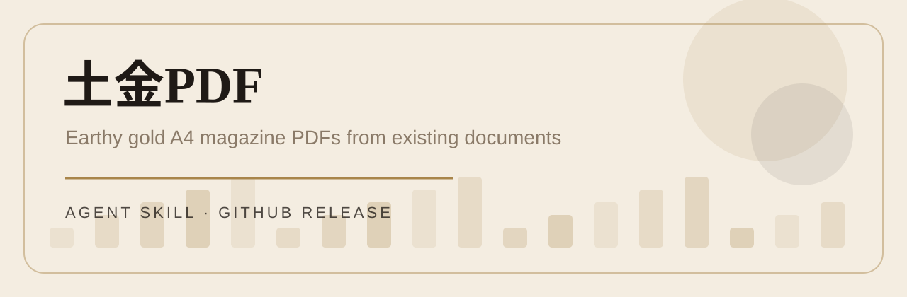
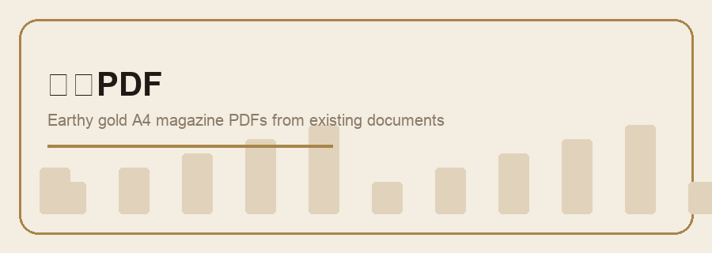
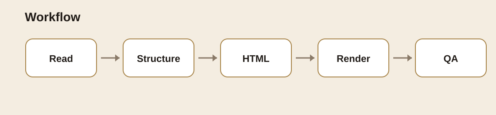
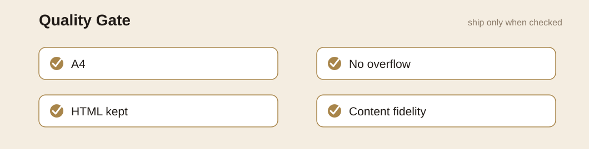

# 土金PDF

[English](README_EN.md) | 中文




把现有文档排版成克制、精致、土金色系的 A4 杂志风 PDF。

土金PDF 只做一件事：**把已有内容变成更适合交付、归档、展示的 PDF**。它默认保留原文内容、数字、日期、人名、结论和业务口径；除非用户明确要求，否则不擅自改写内容。

```text
读取内容 → 生成 A4 HTML → 浏览器渲染 PDF → 检查溢出/分页/保真 → 交付 HTML + PDF
```



---

## 适用场景

- 项目总结、交付归档、客户确认材料
- 报告、方案、报价单、复盘记录
- Markdown、TXT、HTML、DOCX、PDF、XLSX 中提取出的内容
- 用户直接贴在对话里的文本材料
- 需要“别太花，但要有质感”的中文商务文档

## 不适用场景

- 需要大幅改写、删改事实、调整业务口径的文案任务
- 需要像素级复刻原 PDF 的排版还原任务
- 需要公开发布、发送客户或上传外部平台但尚未确认内容的任务
- 需要模仿第三方商业模板到高度相似的任务

---

## 视觉系统

| Token | 用途 | 色值 |
|---|---|---|
| 暖纸背景 | 页面底色 | `#f4ede1` |
| 辅助底色 | 卡片/浅底区 | `#efe6d6` |
| 主文字 | 标题和正文 | `#1f1a16` |
| 次文字 | 说明和辅助信息 | `#4a3f33` |
| 注释文字 | 页脚、备注 | `#8a7a68` |
| 金色强调 | 线条、序号、重点 | `#a8854a` |

版式原则：

- A4 页面，`210mm x 297mm`
- 首页做封面：来源、文档类型、主标题、关键元信息
- 正文按章节组织：章号、标题、正文、表格、信息块
- 表格短内容居中，长内容左对齐
- 表头统一居中
- 保持留白，不用堆装饰制造“高级感”

---

## 安装

把本目录放到支持 Agent Skills 的 skills 目录下：

```bash
~/.codex/skills/tujinpdf/
```

或使用支持 GitHub 安装的 skills runtime：

```bash
npx skills add https://github.com/judeyang/judeyang-skills/tree/main/tujinpdf
```

---

## 触发示例

```text
用土金PDF把这份项目总结排版成 PDF
把这个 Markdown 做成土金色系杂志风 PDF
生成一个客户确认归档 PDF，使用土金PDF风格
把这个 Excel 里的内容整理成一份土金PDF 报告
```

---

## 输出内容

默认生成：

- 一个 A4 HTML 源文件
- 一个同名 PDF
- 必要时生成预览截图用于排版检查

HTML 源文件必须保留，后续修改应在原 HTML 上迭代，不要每次重新生成。

默认不覆盖旧版本，文件名使用：

```text
文档主题_土金PDF_v01.html
文档主题_土金PDF_v01.pdf
文档主题_土金PDF_v01_preview.png
```

---

## 工作流程



1. **读取源内容**：确认文件路径、目标读者、是否只改版式。
2. **提取结构**：识别标题、日期、章节、表格、列表和关键数字。
3. **生成 HTML**：使用 A4 页面、土金色系变量、封面、章节、表格样式。
4. **渲染 PDF**：用真实浏览器输出 PDF 和预览截图。
5. **质量检查**：检查溢出、重叠、分页、表格和原文保真。
6. **交付说明**：说明生成文件、是否改动原文、未验证项。

---

## 渲染命令

Skill 内置浏览器渲染脚本：

```bash
node scripts/render-html-pdf.mjs input.html output.pdf --screenshot preview.png
```

脚本会优先使用可用的 Puppeteer；如果 Puppeteer 自带 Chrome 缺失，会尝试本机 Chrome。

## 校验与回归

新增的回归资产用于 Darwin 或人工检查：

- `test-prompts.json`：覆盖新建排版、续改修复、敏感商业内容。
- `examples/`：包含最小样例输入和期望输出说明。
- `scripts/validate-output.mjs`：检查 HTML/PDF/预览图、A4 页面合同、占位符和调试痕迹。

```bash
node scripts/validate-output.mjs output.html output.pdf preview.png
```

---

## 质量门槛



交付前必须检查：

- PDF 能打开
- 页面为 A4
- 首页无多余外框和无关装饰
- 标题、正文、表格层级清楚
- 无文字溢出、重叠、截断
- 无异常大段空白
- 表格短内容居中、长内容左对齐
- 原文内容没有被静默改写
- HTML 源文件和 PDF 同时保留
- 文件名版本号一致

---

## 🔴 检查点

以下情况必须先确认再继续：

- 要改写、删除或隐藏原文事实、数字、价格、日期、责任或客户反馈
- 要覆盖旧版 HTML/PDF
- 源内容包含合同、报价、发票、财务、法律、隐私、账号、支付或客户敏感数据
- 要上传到外部在线服务、公开发布或发送给客户

---

## 不要做什么

- 不要只交 PDF 不交 HTML
- 不要静默改写原文
- 不要使用 ReportLab 手搓复杂 PDF
- 不要卡片套卡片或堆无意义装饰
- 不要把命理、FatePaw 或其他业务内容带进普通文档
- 不要在未检查 PDF 的情况下说完成

---

## 文件结构

```text
tujinpdf/
├── SKILL.md
├── README.md
├── README_EN.md
├── agents/
│   └── openai.yaml
├── examples/
│   ├── expected-output-notes.md
│   └── sample-report.md
├── references/
│   └── fatepaw-style-notes.md
├── templates/
│   └── base-a4.html
├── scripts/
│   ├── render-html-pdf.mjs
│   └── validate-output.mjs
└── test-prompts.json
```

---

## License

MIT License. See [LICENSE](LICENSE).
