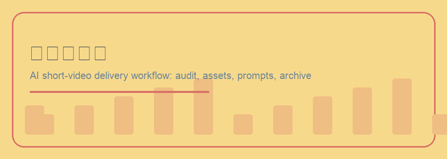
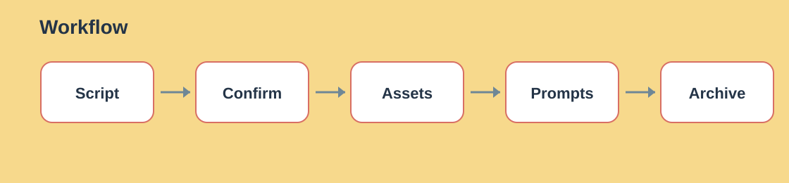
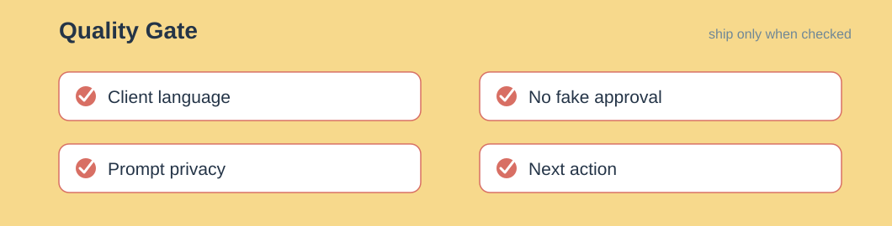

# Wes Anderson Project Pilot

English | [中文](README.md)


Turn an AI short-drama or short-video script into a confirmed, executable, and archivable production package.

Wes Anderson Project Pilot is not an abstract script critique tool or a director-style prompt tool. It is a delivery-oriented Agent Skill that turns client scripts into script audits, client confirmation workbooks, asset production sheets, prompt tables, final confirmation PDFs, and internal per-shot production workbooks.

```text
Client script → Script audit → Client confirmation → Assets → Per-shot prompts → Final archive
```



---

## Use Cases

- AI short-drama and short-video script review
- Client feedback and revision tracking
- Character, scene, product, prop, and effect extraction
- Internal asset production workbooks after script audit
- Headshot, full-body, three-view, and scene-setting prompts
- Client-facing Excel confirmation files
- Final confirmation PDFs
- Internal per-shot image and video prompt tables

## Not For

- Simple copy-editing tasks
- Lightweight one-off image prompt requests
- Final asset generation before client confirmation
- Sending internal prompt-engineering details directly to clients

---

## Workflow



1. **Create project**: scaffold folders and create `项目名_脚本与资产确认表_v01.xlsx`.
2. **Script audit**: keep script review, visual direction, asset confirmation, and revision tracking in the main client workbook.
3. **Internal asset production**: create `05_内部制作执行/设定资产制作表_v01.xlsx`.
4. **Asset confirmation**: write finished image filenames and paths back into the client confirmation workbook.
5. **Final archive**: create a client-readable confirmation PDF.
6. **Internal execution**: create per-shot first/end-frame, optional keyframe, and video prompt tables.

---

## Output Structure

```text
02_用户确认文件/
03_设定资产/
04_最终确认归档/
05_内部制作执行/
```

---

## Installation

This skill now lives in the unified `judeyang/judeyang-skills` repository. Install `shot-designer` together with `wes-anderson`; otherwise asset prompts, first/end/keyframe prompts, per-shot video prompts, and prompt validation will be missing.

Recommended installation:

```bash
git clone https://github.com/judeyang/judeyang-skills.git
cp -R judeyang-skills/wes-anderson ~/.codex/skills/
cp -R judeyang-skills/shot-designer ~/.codex/skills/
cp -R judeyang-skills/tujinpdf ~/.codex/skills/
```

Base installation, without formal user-facing PDF archive support:

```bash
cp -R judeyang-skills/wes-anderson ~/.codex/skills/
cp -R judeyang-skills/shot-designer ~/.codex/skills/
```

Dependency notes:
- `shot-designer`: required. Owns prompt standards, prompt workbook generation, and prompt validation.
- `tujinpdf`: required for formal final user-facing confirmation/archive PDFs. If it is missing, pause and ask to install it; use a simpler PDF workflow only when the user explicitly accepts a legacy fallback.

If a runtime installs only `wes-anderson`, it will usually not show an automatic system-level dependency prompt. The skill must tell the user to install the companion skill when the workflow reaches prompt production.

---

## Example Prompts

```text
Review this AI short-drama script.
Turn this short-video script into a client confirmation workbook.
Generate character and scene-setting prompts.
Create a per-shot video prompt table from the client confirmation workbook.
```

---

## Quality Gate



- Client-facing files must use language a client can understand.
- Do not expose internal prompt-engineering details in client confirmation files.
- Do not include internal commercial wording such as workload, billing, or settlement in client archives.
- Each phase must clearly show confirmation status and blocking items.
- After each phase, proactively tell the user what the next confirmation or input should be.
- Missing client materials must be marked as `待提供`, not as confirmed.
- Do not create extra naming-example documents; keep naming guidance in `00_项目说明_文件夹与命名规则.md`.

---

## 🔴 Checkpoints

Pause for confirmation before continuing when:

- the script would be treated as approved before script audit feedback is confirmed
- character, scene, product, prop, or effect images would be submitted to the client before being referenced back in `项目名_脚本与资产确认表_v01.xlsx`
- the final confirmation PDF would be created before the script, visual direction, and asset images are confirmed
- `镜头设计师/references/prompt_standard.md` or prompt scripts would be changed without explicit approval
- files must be publicly published, sent to a client, or written into a production directory

---

## Structure

```text
wes-anderson/
├── SKILL.md
├── README.md
├── README_EN.md
├── agents/
│   └── openai.yaml
├── references/
│   ├── audit_checklist.md
│   └── client_facing_doc_standard.md
└── scripts/
    ├── audit_script.py
    ├── build_client_confirmation_pdf.py  # legacy fallback only
    ├── create_project.py
    └── validate_client_facing_text.py
```

Prompt standards, prompt workbook generation, and prompt validation now live in the `镜头设计师` skill.

---

## License

MIT License. See [LICENSE](LICENSE).
